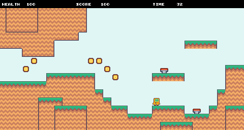

# JS13K Starter

A starter template for the [js13kgames competition](https://js13kgames.com/).



Play live demo: <https://js13k-starter.vercel.app/>

This starter project uses [js13k-vite-plugins](https://github.com/codyebberson/js13k-vite-plugins) for js13k optimized tooling. See [js13k-vite-plugins](https://github.com/codyebberson/js13k-vite-plugins) for more information about tooling and configuration.

This demo currently builds to about 4 kB. Don't let this initial size overly concern you! The magic of the js13k compression process means that the final zipped size doesn't simply grow linearly with every line of code you add – the results can be quite unpredictable. The most important thing is to focus on creating your game. Rest assured, this starter equips you with the same powerful optimization toolchain that many js13k veterans rely on.

## Usage

### Install

Clone and install dependencies:

```bash
git clone git@github.com:codyebberson/js13k-starter.git
cd js13k-starter
npm i
```

### Dev server

Start the dev server with hot reload:

```bash
npm run dev
```

Open your web browser to <http://localhost:3000/>

### Production build

Create a final production build:

```bash
npm run build
```

### Preview production build

After building, you can preview the production build with Vite's built-in server:

```bash
npm run preview
```

## Acknowledgements

[Frank Force](https://twitter.com/KilledByAPixel) for [ZzFX](https://github.com/KilledByAPixel/ZzFX)

[Keith Clark](https://twitter.com/keithclarkcouk) and [Frank Force](https://twitter.com/KilledByAPixel) for [ZzFXM](https://keithclark.github.io/ZzFXM/)

[Kang Seonghoon](https://mearie.org/) for [Roadroller](https://lifthrasiir.github.io/roadroller/)

[Rob Louie](https://github.com/roblouie) for Roadroller configuration recommendations

[Salvatore Previti](https://github.com/SalvatorePreviti) for Terser configuration recommendations

[Kenney](https://kenney.nl/) for [Pixel Platformer](https://kenney.nl/assets/pixel-platformer) graphics

[Andrzej Mazur](https://end3r.com/) for organizing js13k

## License

Code: MIT

Graphics: Creative Commons CC0 1.0 Universal
