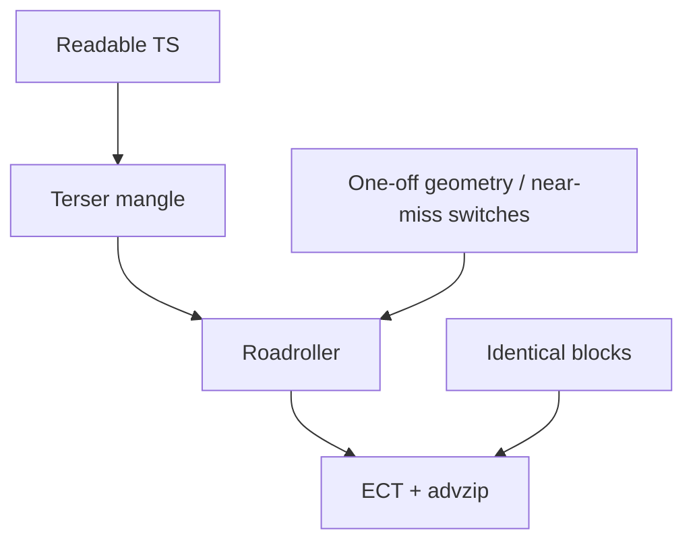

# Size golfing pass (superset)

Merged from [size_golfing_pass-fable.plan.md](size_golfing_pass-fable.plan.md) and [size_golfing_pass-grok.plan.md](size_golfing_pass-grok.plan.md). Unique claims from either plan were checked against current `src/` (2026-08-20). Items that could not be re-measured (zip deltas, minified module sizes, packed audio bytes) are labeled as **prior measurement**.

**Do not implement from this document until asked.** This is the plan only.

---

## Status snapshot (2026-08-28)

**Under budget.** Live zip: **12,006 B / 13,312 (90.19%). Headroom 1,306 B.** See [SIZE_LOG.md](../SIZE_LOG.md).

Audio is **back in** the production zip (SoundBox `smallplayer.ts` + song + 5 SFX). Pipes / opening cutscene are Director's Cut. Infinite white map has no solids — player snap + enemy/bolt wall tests were unique no-ops and were deleted (restore from git if walls return).

We are **not over**. Track 2 is optional. Highest-confidence leftover reclaim if we need zip later: **Start SPD shop row**, **damage numbers**, then last-resort **instant wave** / remaining cutscene motion.

---

## Status snapshot (2026-08-20, after Dye Hard / plaza cutscene / shop cuts)

Checked against production `src/` (not `_sample-game/`). Historical — Track 1 has since been run; see the 2026-08-28 snapshot above.

### Already landed (not a measured golf pass — shipped as design)

| Item | Where | Notes |
|------|--------|-------|
| **Straighten pipes** (Track 2 #2 / SPEC fallback #4) | `buildPipeSimple`; snake in `src/directors-cut/` | **DONE.** Competition layout is straight/diagonal. |
| **Surge / stretch difficulty** (SPEC fallback #2) | never shipped | **N/A — 0 B.** Do not implement. |
| **Production audio** (Track 1 D music/zzfx, Track 2 #5) | no `src/audio.ts` / `zzfx.ts` / `music.ts` | **DONE as a cut.** Synth lives only in `_sample-game/`. Tremolo strip is moot for zip. |
| **Unify player/miniboss/finale powers** (Cluster B 4–6) | `src/combat.ts` bitfield novas | **DONE.** Shared `novas[]`, white stomp is `N_WHITE`, no separate `tryFireball` / `tickFinale` chains. |
| **Opening cutscene walk-on / march** (Track 2 #1 partial) | `src/cutscene.ts` | **PARTIAL.** Deleted portal fade, boss walk, 7 marching minibosses, 3rd dialogue. **Kept** (and expanded) pipe-drop + simultaneous portal→cap drain waves + `greyTwin`. Not the “static panels only” cut. |
| Dye Hard title / plaza tableau / shard stays in-run | overlays, ui, index, player | Presentation work; **spent** bytes, not a golf win. |
| **Horn → static L/R lash** (Cluster E / Track 2 #6) | `src/combat.ts` | **DONE (redesign, not deleted).** 1.5s cycle (right/left/rest×4), chevron kept, 3px+1px outline, no facing/diagonals. Diagonal-release grace **removed**. |
| **Shop rows** (Track 2 #10–11 + shop STR/DEX/CON/WIS) | `src/stats.ts` | **DONE.** Shop is 4 rows: Start HP, Start SPD, Magnet, Revive. Luck, shop stats, XP Gain, Scrap Gain are gone. In-run STR/DEX/CON/WIS cards remain. Hands always 3. |

### Still open if we need zip

Highest-confidence remaining reclaim: **Start SPD shop row**, **simpler miniboss death**, **damage numbers**, **pixelScale / spawn packing / pipe dir tables**, then last-resort **instant wave** / remaining cutscene motion. Full flags are on the Track 1 / Track 2 lists (`**DONE**` / `**PARTIAL**` / `**OPEN**`).

---

## Critical — change classification (non-negotiable)

A prior golf pass changed things that **looked or played differently**. That must not happen in bulk again.

### May be done in bulk

Only refactors / packing that **do not fundamentally affect the game**: same pixels, same audio, same hitboxes, same numbers, same spawn/drop/pipe/cutscene behavior.

Still **measure zip after each cluster**. Roadroller rewards identical repetition; a “smaller source” helper can grow the zip. Revert any cluster that does not pay.

### Must be one-at-a-time + live user testing

**Any change that can alter gameplay, combat feel, visuals, audio, pipe layout, collision, cutscene choreography, or UI placement.**

For each such change:

1. Implement **exactly one** change (one helper, one table, one deleted VFX, one shop row, etc.).
2. `npm run build` and log the advzip delta.
3. **Live user testing** in the dev server against the pre-change behavior.
4. **Sign off** (keep) or **revert** before starting the next change.

Do not batch “small” visual tweaks with “safe” golf. Do not sign off from code inspection alone.

### How to classify when unsure

If a refactor *could* move a pixel, change a cooldown, skip a power, retarget a bolt, alter wall sliding, wrap dialogue differently, or change an SFX — treat it as **one-at-a-time**. The bulk lane is only for dead code and packing whose output is demonstrably identical.

---

## Gap and method

- Limit: **13,312 B**. Prior working zip: **15,137 B** (Grok) / **15,105 B** (Fable clean rebuild). Gap **~1,825 B** (~14% over).
- Re-record baseline from a clean `npm run build` before touching code. Keep [SIZE_LOG.md](../SIZE_LOG.md) (does not exist yet).
- Zip contents: Roadroller-inlined `index.html` + `sprites.png` (**672 B** verified in `public/sprites.png` and `dist/sprites.png`).
- Names are already mangled — **do not rename identifiers**.
- Observed zip/minified ratio from the Fable pass: **~0.31** (prior measurement). Use it only as a rough translator; zip is the scoreboard.

**Protocol:** one cluster (bulk lane) or one signed-off change (risky lane) → `npm run build` → log advzip → keep or revert.

SPEC rule 3: Roadroller rewards *identical* repetition and punishes *near-miss* control flow. Collapse similar-but-different power loops; do **not** extract helpers from copies that are already identical without measuring. A prior Fable cluster that unified combat helpers **grew the zip (+51 B)**.

---

## Where the bytes live

Production `src/` (excluding `_sample-game/` and `debug.ts`), verified 2026-08-20:

| Area | File | LOC | Notes |
|------|------|----:|-------|
| World / pipes | [src/pipes.ts](../src/pipes.ts) | 749 | `buildPipeSimple` + kits. Snake walker is Director's Cut. Preview/push dir duplication remains. |
| Combat | [src/combat.ts](../src/combat.ts) | 497 | Unified bitfield novas + static L/R horn chevron (still unique draw). |
| Swarm | [src/enemies.ts](../src/enemies.ts) | 760 | Spawn/teleport/cap, spatial-hash `separate()`, three copy-pasted ~17-field spawn literals. |
| Cutscene | [src/cutscene.ts](../src/cutscene.ts) | 367 | Pipe-drop + simultaneous drain. Only consumer of `greyPipeCanvas` / grey twin kits. |
| UI / meta | overlays 396 + ui 266 + stats 117 | ~779 | Menus, **4 shop rows**, card copy. |
| Audio (keep as a system) | zzfx + zzfxm + music + audio | ~431 | Prior measurement: **~1,372 B packed** (music ~533, synth+SFX ~839). **Not in production zip.** |
| Engine | sprites, map, player, index, … | rest | Bake, tiles, collision, color-wave double-draw. |

Fable prior minified module sizes (esbuild metafile, not re-run): `enemies` 6807, `pipes` 6803, `combat` 6675, `cutscene` 3089, `overlays` 2478, `player` 2436, `ui` 2082, `stats` 1971, `index` 1929.

**Already not in the game (SPEC fallback #2 saves 0 B):** surge spawns and stretch difficulty modes. [src/enemies.ts](../src/enemies.ts): *“surge spawns are a later phase”*. Do not implement them.

**Do not touch for zip:** `_sample-game/`, `debug.ts` (DEV-only dynamic import), sprite-sheet crop, identifier shortening, comments.

---

## Independent verification (conflicts and unique claims)

| Claim | Source | Verdict |
|-------|--------|---------|
| Strip unused ZzFX **biquad filter** (param 20); “no SFX sets it”; prior A/B **~199 B** | Grok | **Reject.** `SUCCESS`, `PICKUP`, and `HIT` in [src/audio.ts](../src/audio.ts) all set param 20 (`297`, `-1380`, `1914`). Stripping it **changes those SFX**. |
| Strip unused ZzFX **tremolo** (param 19); keep the filter | Fable | **Keep.** No SFX or music instrument sets param 19. Filter is used (see above). |
| Hardcode unused randomness default | Fable | **Careful.** Default is `p[1] ?? 0.05`. Music instruments pass `0`; SFX omit it and rely on **0.05**. Hardcoding to `0` would change SFX. Baking `0.05` as the omitted default is OK. |
| Drop `pixelScale` — every caller uses `1` | Grok | **Keep.** [src/sprites.ts](../src/sprites.ts) default is `1`; `createWalkSprites` passes `1`; no other caller passes a scale. Nested `px/py` loops are unused generality. |
| `cornerDefs` formula `inner=i&1, flipH=i&2, flipV=i&4` | Fable | **Fix mapping before use.** Table in [src/pipes.ts](../src/pipes.ts) matches `inner=i&1`, **`flipV=i&2`, `flipH=i&4`**. Port flags: H-port = `inner XOR flipV`, V-port = `inner XOR flipH`. Wrong bits = wrong elbows. |
| Font: drop `?`; `.` / `-` maybe; `/` maybe | both | **`+` used** (level-up `STR +0`). **`/` used** (`0/3` shop lines). **`'` unused** after Dye Hard dialogue rewrite. **`!` and `,` used**. **`J` and `?` unused**. `.` and `-` look unused — re-scan immediately before dropping. Glyph ints compress well; savings may be ~0. |
| `hex()` / share `padStart(6,'0')` | Fable yes / Grok no | Six identical sites exist (palette, combat, enemies, fx, hud, overlays). SPEC + Fable Cluster A say extracting identical copies can **hurt**. Optional, low priority, measure and revert. |
| Share `hitsWall` / `drawHpBar` / `tickLife` / `overlaps` / `makeCanvas` | Fable yes / Grok “skip unless desperate” | Duplication is real (`combat.wallBox` ≡ `enemies.hitsWall`; player HP bar ≡ miniboss HP bar). Same compression warning. Optional, measure and revert. **Do not** replace player’s `OVERLAP_EPS` variant. |
| Unify player + miniboss + finale into one `castPower` | Grok | **Not identical today.** Player uses `kitDamage`/`colorDamage`/`powerAmount` + heal FX; AI uses base constants. Miniboss skips yellow (`color === 2`) and only fires while `chasing`. Finale heal **returns false at full HP**; miniboss heal always applies. `primeFinalePowers` staggers first volley. Naïve merge **changes combat**. One-at-a-time. |
| Fold `stompFlash` into `novas` as a white nova | Fable | Draw loops match (expanding dual-stroke ring). Stomp is black/white; novas are black/`nova.color`. Parameterized ring helper can be identical — still one-at-a-time (visual). |
| `LUCK_FOURTH` / `LUCK_FIFTH` → `luck*.25` / `luck*.2` | Fable | **N/A.** Luck row and extra-card rolls are **deleted**. Hands are always 3. |
| Pre-break cutscene `SCRIPT` and delete `wrap()` | Fable | Wrap is **view-width dependent** (`panelW = min(viewWidth-8, 240)`). Pre-broken lines are identical only at the wrap width you bake. One-at-a-time; test more than one window size. |
| Music stays / do not drop ZzFXM | Grok | Working constraint for Track 1. Factoring repeated drum/bass rows is golf. Shortening or cutting the song is Track 2 only. |
| Audio is not the overage | Grok | Consistent with SPEC reservation (~1.5–2 KB) if the ~1,372 B packed figure holds. Re-measure. |
| Cluster A combat-helper golf pays | Fable estimate vs result | **Did not pay.** Implemented pass: baseline 15105 → cluster-a **15156 (+51)**. Prefer collapsing *near-miss* control flow over extracting already-identical blocks. |

---

## Historical golf pass (Fable, 2026-08-19) — evidence, not current tree

That pass is **not landed** on this branch: current source still has duplicated spawn literals, `wallBox`/`hitsWall`, tremolo, `pixelScale`, etc.

| Stage | advzip | Delta |
|-------|-------:|------:|
| baseline | 15105 | — |
| cluster-a (combat/enemy helpers) | 15156 | **+51** |
| cluster-b (pipes) | 15148 | -8 |
| cluster-c–f (batched) | 15043 | -105 |
| **final** | **15043** | **-62** |

Target 13312. Remaining gap after that pass: **1731 B**.

Largest reported wins: music pattern factoring, zzfx tremolo strip, cutscene wrap removal, stats shop packing.

**Lesson:** golfing alone ate ~62 B. Closing ~1,825 B almost certainly needs Track 2 cuts. Do not assume helper extraction helps. The c–f batch also mixed risky changes — this time, do not batch them.

---

## Track 1 — Code golf (do this first)

Work in small clusters in the **bulk** lane. Anything flagged **one-at-a-time** waits for live sign-off.

### Cluster A — dead unique code (bulk; highest confidence)

- **OPEN — Drop `pixelScale` from bake** in [src/sprites.ts](../src/sprites.ts). Nested `px/py` loops, struct field, and default arg are unused generality. Expected: identical sprites.
- **N/A — Strip unused ZzFX tremolo** in `src/zzfx.ts`. Production no longer ships ZzFX; only `_sample-game/zzfx.ts` has tremolo.
- **OPEN — Tiny: unused font glyphs** in [src/font.ts](../src/font.ts) `CHARS`/`GLYPHS` — only after a fresh string audit. Candidate drops: `J`, `?`, `.`, `-`, `'`. **Do not drop `/` `!` `,` `+`** (`+` is in level-up titles). Measure; savings may be ~0.

### Cluster B — combat / enemies near-miss (mostly one-at-a-time)

Verified duplication:

- Player: `tickFire` + per-power lambdas (~234–273)
- Miniboss: `color === 0..6` chain, skips yellow, raw constants (~399–437)
- Finale: `tickFinale` ×6, almost the miniboss set (~451–495)
- `tryFireball` / `tryFrostball` differ by kind / damage / freeze args
- Stomp draw and nova draw are the same expanding double-stroke ring
- Player shield draw vs boss shield draw in [src/enemies.ts](../src/enemies.ts)
- Three ~17-field spawn literals (`spawnMinibosses` / `spawnFinalBoss` / `trySpawn`)

**Candidates, each its own signed-off change unless proven output-identical:**

1. **OPEN** — `mkEnemy(overrides)` / `makeEnemy(x, y, extra)` for the three spawn sites (`spawnMinibosses` / `spawnFinalBoss` / `trySpawn` still copy ~17 fields). **bulk OK** if every field matches today’s literals (`bobTime` random only on regulars, miniboss `color: i`, finale `FINAL_HP` + `chasing: true`, etc.).
2. **DONE** — `tryBolt` / `tryFireball`/`tryFrostball`. Combat is one bolt kind + nova bits.
3. **DONE** — Shared nova period; no separate finale tick chain.
4. **DONE** — Per-color action table. Bitfield novas; yellow skip / chasing / stagger live in that path.
5. **DONE** — Player scaling stayed out of AI (`hornPwr` / `novaPwr` vs base).
6. **PARTIAL** — White stomp is already a nova bit (`N_WHITE`). Horn chevron is a static L/R V (Cluster E **DONE**). Shield ring draw may still duplicate.
7. **OPEN** — Axis-move helper for knockback/chase wall tests — **optional**. Identical copies; may not pay (Cluster A evidence). If attempted, one-at-a-time (movement).
8. **OPEN** — Pack `EnemyType` bake into positional arrays / formula `hp`/`radius`/`dmg` — **one-at-a-time** (hitboxes and HP). Formulas today: `hp = 8 + tier*4`, `contactDamage = tier+1`, `radius = max(w,h)/2`.

**Risk:** a unique table format can *lose* to three similar `if` chains. If the zip grows, revert and keep only the pieces that paid.

### Cluster C — pipes direction tables (one-at-a-time; not a redesign)

**All still OPEN.** Layout is already `buildPipeSimple`; these are packing the remaining near-miss dir switches, not another straighten.

In [src/pipes.ts](../src/pipes.ts), `straightPreview`, `pushStraight`, and `pushCap` each have four `if (dir === E/W/S/N)` blocks with slightly different literals. Compact per-dir rows (`dx, dy, w, h, capInset`) shared by preview and push.

Also from Fable (same file, still not a `buildPipe` rewrite):

- **OPEN** — Merge `straightPreview`+`pushStraight` and `curvePreview`+`pushCurve` into placer functions (preview = dry run, push = commit).
- **OPEN** — Replace the 8-row `cornerDefs` table with the **corrected** generator (see verification table). Live-test all 7 pipes for accents and collision.
- **OPEN** — Direction lookup for `pushCap` offsets and `portalFromCell` edge branches.
- **OPEN** — Pack atlas rects (`CAP`, `STRAIGHT`, `CURVE_*`, `PORTAL_*`) as flat arrays; loop cap/portal bakes.
- **OPEN** — Replace `greyTwin: Map` with a parallel array keyed by `kitCanvasList` order — **skip if deleting grey kits** (cutscene still uses `greyPipeCanvas` for un-activated pipes). Deleting grey twins entirely is a presentation cut, not this cluster.

**Do not** rewrite `buildPipe` here — that is Track 2 (straighten). **Do not** merge the two `mulberry32` copies (`map.ts` / `pipes.ts`) without measuring.

Pipe layout is both visual and gameplay (collision, miniboss homes, portals). **Every pipes change is one-at-a-time + live test.**

### Cluster D — player / pickups / stats / ui / cutscene / index

**Bulk OK (packing, same strings and numbers):**

- **OPEN** — [src/stats.ts](../src/stats.ts): draft cards as positional tuples instead of `{id,title,body}` **if** the UI still receives the same titles/bodies; packed `[name, cost]` shop table (`SHOP_NAME` + `SHOP_COST` already parallel, now 4 rows). Luck formulas are **N/A**. **No string shortening** here (that is Track 2).
- **N/A** — [src/audio.ts](../src/audio.ts) / [src/music.ts](../src/music.ts): not in production. Factoring drum rows is moot until audio returns.
- **OPEN** — [src/pickups.ts](../src/pickups.ts): `add(x, y, kind)` with a size table. Preserve scatter: boss guaranteed scrap uses ±14; `dropLoot` uses ±4.
- **OPEN** — [src/overlays.ts](../src/overlays.ts): merge `openDeath` / `openWin` (identical except title). Tiny.
- **OPEN** — [src/index.ts](../src/index.ts): reuse a `cam` object in `cameraOrigin` (already called twice per frame). No visual change if clamp math is unchanged.

**One-at-a-time (easy to change the game):**

- **OPEN** — [src/player.ts](../src/player.ts) axis-generalize the 4-way collision snap (~192–291): one `snap(axis, dir)` + `edgeMin`/`edgeMax` replacing string-tagged `min/maxOverlappingTileEdge`. Wall sliding is gameplay.
- **OPEN** — [src/ui.ts](../src/ui.ts): merge `openMenu`/`openCards`; title-screen `headingTop` layout is now load-bearing (rainbow title above shard, buttons below unicorn). Do not “move it out” without a live test.
- **PARTIAL** — [src/cutscene.ts](../src/cutscene.ts): `PH_ENTER` / `PH_MARCH` / portal-alpha loops are gone. `wrap()` remains (two lines, view-width dependent). Skip handling still densifiable. Grey-pipe drain waves are new unique code (zip tax, not a save).

### Cluster E — unique polish that compresses poorly (feel changes — not bulk)

These are still “golf,” but they **change juice**. Do after A–C so the remaining gap is known. **Each item is one-at-a-time + live test.** They are closer to Track 2 than to bulk golf.

- **DONE — Horn chevron redesigned** in [src/combat.ts](../src/combat.ts). Not the AABB-flash cut: kept a static left/right V, 3px black + 1px white same-path outline, 1.5s lash cycle. Unique trig / facing / travel animation **gone**. Further shrinking the V (or deleting it) is still possible but not planned.
- **DONE — Diagonal facing grace** deleted from [src/player.ts](../src/player.ts) with the facing fields. Movement is unchanged.
- **PARTIAL — Heal `+` float** is already gone. **OPEN — floating damage numbers** in [src/fx.ts](../src/fx.ts) (`spawnDamageNumber`, ~40 LOC). Keep pixel explosions (used everywhere → compresses).
- **OPEN** — Merge `openDeath`/`openWin` is in Cluster D (not a feel change).

**Skip unless desperate:** extract `hitsWall` / `hex` / `drawHpBar` / `tickLife` / outline-box / view-cull / `makeCanvas`. Small identical loops already compress; a shared function can be a wash or a regression.

---

## Track 2 — Ranked cut menu (you pick after golf numbers)

Estimates are **packed-byte bands, not source lines**. Several also delete golf-targets (e.g. static cutscene removes `greyTwin`, so do not golf grey kits first).

**Every Track 2 item is a gameplay or presentation change: one-at-a-time, live user testing, then sign-off.**

### Presentation (keep the run, cheapen the movie)

1. **PARTIAL — Static opening cutscene** (SPEC fallback #1) — remaining **~200–400 B** if we go fully static
   - **Done:** portal fade, boss walk, 7 marching minibosses, third dialogue panel.
   - **Still in:** timed pipe reveal, simultaneous reverse drain waves, `greyTwin` / `greyPipeCanvas`, `wrap()`. Full static = delete those; world would snap grey after the boss line.
   - Loss: the pipe-lay + drain movie we just signed off.

2. **DONE — Straighten pipes** (SPEC fallback #4). Snake walker is Director’s Cut only.

3. **OPEN — Instant color unlock** (SPEC wave fallback) — **~150–350 B**
   - Delete `snapshotTiles` / `tileCanvasesPrev` / clip-arc double `drawTiles` / expanding `colorWave` **and** the new 7-way drain clips. Unlock + short flash.
   - Loss: radiating drain *and* restore waves (the thesis of the current cutscene/combat juice). Do not take this lightly.

4. **OPEN — Simpler miniboss death** — **~80–200 B** (related Fable item: pipe-death explosion spam reduction ~50–100)
   - One explosion + hide the whole pipe, instead of `takePipeSegment` per-piece timed pops. Keep unlock overlay + power grant.
   - Considered and **scratched** for now (the staggered eat is the compelling beat). Revisit only if still over.
   - Loss: the pipe-eaten-by-explosions beat.

5. **N/A — Shorter placeholder song.** Production audio is already stripped. Re-adding music is a spend, not a reclaim.

6. **DONE — Horn chevron VFX.** Kept as static L/R (not deleted). No remaining facing/travel math.

7. **OPEN — Pipe accent-continuity** (inner/outer curve kits; occasional rim seams) — **~200–300 B**
   - Grok treated accent elbows as load-bearing; Fable listed this as a cut. It is a **visual** cut, not golf. Late rung.

8. **PARTIAL — Floating damage numbers / heal `+`** — heal `+` already gone. Damage pops still **~100–170 B**.

9. **OPEN — Shorter dialogue / UI / unlock strings** — **~100–200 B**. Unique strings compress worst. Content decision, not golf.

### Meta / systems (keep combat, thin the between-run layer)

10. **DONE — Drop shop rows XP GAIN + SCRAP GAIN** (SPEC fallback #3). Drop chances are inherent only.

11. **DONE — Drop LUCK row** (and shop STR/DEX/CON/WIS). `LUCK_FOURTH` / `LUCK_FIFTH` deleted. Hands are always 3. In-run stat cards remain; they do not persist.

12. **OPEN — Drop START SPD** — **~50–80 B**
    - Overlaps yellow speed. Keep in-run yellow + shop Start HP / magnet / revive.

13. **OPEN — Final boss 2–3 powers instead of 6** — **~100–160 B**
    - SPEC allows dropping finale heal/ward if the fight drags. Small bytes. Not the same as cutting a player power.

14. **OPEN — Cut frostball or ward power** — **~120–250 B**
    - Grok: any of the 7 player powers is core loop. Last resort only.

### What not to cut unless everything else fails

- Whole scrap shop, magnet, persist — SPEC “must-have.”
- Walk-frame `legCut` — cheaper than extra sheet art.
- Spatial-hash `separate()` — needed at 150 cap.
- Palette bake / greyscale world — the game’s thesis.
- Any of the 7 player powers or “miniboss uses that color’s power” — core loop.
- Music system (ZzFXM + looping song) unless SPEC ladder #5 is explicitly chosen.

### Suggested spend order if still over after Track 1

**Least identity loss first** (Grok, adjusted because SPEC fallback #2 already saves 0 B):

Start SPD row → simpler pipe death → (last resort) instant wave / remaining cutscene motion.

SPEC’s original ladder was: static cutscene → surge/stretch (gone) → shop rows → straighten pipes → shrink audio.

**Already spent from that ladder:** straighten pipes, production audio, most of the old choreographed cutscene, most shop rows (Luck / shop stats / XP / Scrap Gain). **Still in the shop:** Start HP, Start SPD, Magnet, Revive. **Do not spend instant-wave or remaining cutscene motion** unless the zip still misses after Start SPD / juice cuts — those are the current movie.

Pick after a post-golf number, not before.

---

## Realistic close of ~1,825 B

| Path | Likely zip saved | Notes |
|------|------------------|-------|
| Golf A–C only | maybe 400–900 B | Uncertain; must measure. Fable’s landed A–F only saved **62 B**. |
| Golf A–D / E (incl. juice) | maybe 600–1,200 B | Horn/grace/damage-pops help unique-token tax but **change feel**. |
| Golf + 2–3 menu items | **should land under** | e.g. shop rows + wave + static cutscene, or straighten pipes + static cutscene |
| Fable conservative golf estimate | ~800–1300 zip | Would land ~13.8–14.3 KB — still possibly over. **Not what the implemented pass delivered.** |

Golfing alone is **unlikely** to eat 1,825 B without at least one presentation cut. That is why the menu exists.

---

## Implementation workflow

1. Record baseline advzip from a clean `npm run build`. Start `SIZE_LOG.md`.
2. **Bulk Cluster A** (dead code) → build → log → quick visual/audio sanity (sprites + SUCCESS/PICKUP/HIT still filtered).
3. Remaining Track 1 items: bulk packing clusters vs **one-at-a-time** items per the flags above. Never mix lanes in one commit/cluster.
4. Cluster E juice cuts only if still over and you want feel cuts before systems cuts — still one-at-a-time.
5. Stop and report remaining gap against the menu; **you** choose which rungs to spend.
6. Each chosen Track 2 rung: one change, live test, sign off, then the next.

If a cluster or single change doesn't pay (or fails live test), revert it before continuing.
